# Instalação Zabbix 7.0 - All In One
Material utilizado no Dia 1 da Maratona Zabbix 7.0 - JLCP


- [Instalação Zabbix 7.0 - All In One](#instalação-zabbix-70---all-in-one)
  - [Ambiente utilizado](#ambiente-utilizado)
  - [Ajustes após instalação do S.O](#ajustes-após-instalação-do-so)
  - [Instalar utilitários](#instalar-utilitários)
  - [Desabilitar SELINUX](#desabilitar-selinux)
  - [Firewall S.O](#firewall-so)
  - [Instalando Mysql 8](#instalando-mysql-8)  
  - [Carga Inicial da Base do Zabbix](#carga-inicial-da-base-do-zabbix)
  - [Instalando o Zabbix Server](#instalando-o-zabbix-server)
  - [Instalando o Frontend do Zabbix](#instalando-o-frontend-do-zabbix)


## Ambiente utilizado

Recomendações para o ambiente de estudos e laboratórios:
Obs: Foco em estudos, não recomendado para ambiente produtivo.

Servidor Zabbix
Função: MySQL/Zabbix Server/Frontend.

Sistema Operacional: Oracle Linux 8 (minimal)
* Memória: 3GB de RAM*
* CPU: 1vCPU*
* Disco: 50 GB*

Aproximadamente, em algumas clouds podem variar.

## Ajustes após instalação do S.O

Verificar o timezone atual:

> timedatectl status

Definir o timezone:
> timedatectl set-timezone America/Sao_Paulo

NOTA: Se precisar listar todos os timezone disponíveis para encontrar o seu utilize o comando abaixo:
> timedatectl list-timezones | grep Sao_Paulo

Valide a alteração do timezone:
> timedatectl status

Verifique a data e hora atual: 
> date

**Obs: Defina um IP Fixo no seu S.O.** Pode utilizar o utilitario nmtui.
> nmtui

Definindo um novo hostname:
> hostnamectl set-hostname srv-maratona-01

Atualize o bash com o novo hostname:
> bash

## Instalar utilitários
Realize a instalação dos pacotes basicos necessarios:
> dnf install -y net-tools vim nano wget curl tcpdump

Onde:
* net-tools: Utilitários de rede
* vim e nano: Edição de arquivos
* wget e curl: Requisições web
* tcpdump: Análise de pacotes de rede


## Desabilitar SELINUX
Desabilitar o selinux (aplicação para controle de segurançã em ambientes hrel, há pacotes da zabbix para criação de politicas de selinux, mas em laboratorio iremos desabilita-lo)

Verificar status atual do SELINUX:

> getenforce

Editar o arquivo de configuração e desabilitar o SELINUX

NOTA: Após alteração é necessário reiniciar o servidor.

```
cat /etc/selinux/config
vim /etc/selinux/config
```
Verifique o status novamente:
> SELINUX=disabled

NOTA: Caso não queira reiniciar durante a instalação, utilize o comando abaixo, lembre-se
de reiniciar o servidor após finalizar.

> setenforce 0

Valide o status novamente:
```
sestatus
getenforce
```

## Firewall S.O
Verifique se o firewall está habilitado
> systemctl status firewalld

Saida:

```
Output
[root@labcurso oracle]# systemctl status firewalld
● firewalld.service - firewalld - dynamic firewall daemon
   Loaded: loaded (/usr/lib/systemd/system/firewalld.service; enabled; vendor preset: enabled)
   Active: active (running) since Tue 2024-07-02 06:05:58 -03; 25min ago
     Docs: man:firewalld(1)
 Main PID: 916 (firewalld)
    Tasks: 2 (limit: 22939)
   Memory: 24.8M
   CGroup: /system.slice/firewalld.service
           └─916 /usr/libexec/platform-python -s /usr/sbin/firewalld --nofork --nopid

Jul 02 06:05:57 labcurso systemd[1]: Starting firewalld - dynamic firewall daemon...
Jul 02 06:05:58 labcurso systemd[1]: Started firewalld - dynamic firewall daemon.
Jul 02 06:05:58 labcurso firewalld[916]: WARNING: AllowZoneDrifting is enabled. This is considered an insecure configuration option. It will be removed in a future release. Please consider disabling it now.
```

Verifique a linha Active: se estiver como active (running) o firewall está em execução

Criando regra de firewall e fazendo reload das configurações:

```
firewall-cmd --permanent --add-service=ntp
firewall-cmd --reload
```

## Instalando MySQL 8

Verificando a versão disponível no repositório padrão:

> dnf info mysql-server

Instalando o pacote do mysql server:
> dnf -y install mysql-server

Habilite a inicialização automática, inicie o serviço e verifique o status:
```
systemctl enable --now mysqld
systemctl status mysqld
```

Configurar a senha do usuário root do MySQL:

> mysql_secure_installation

```
Securing the MySQL server deployment.
Connecting to MySQL using a blank password.
VALIDATE PASSWORD COMPONENT can be used to test passwords
and improve security. It checks the strength of password
and allows the users to set only those passwords which are
secure enough. Would you like to setup VALIDATE PASSWORD component?
Press y|Y for Yes, any other key for No: Y
There are three levels of password validation policy:
LOW Length >= 8
MEDIUM Length >= 8, numeric, mixed case, and special characters
STRONG Length >= 8, numeric, mixed case, special characters and
dictionary file
Please enter 0 = LOW, 1 = MEDIUM and 2 = STRONG: 0
Please set the password for root here.
New password: Zbx7-2024
Re-enter new password: Zbx7-2024
Estimated strength of the password: 100
Do you wish to continue with the password provided?(Press y|Y for Yes,
any other key for No) : Y
By default, a MySQL installation has an anonymous user,
allowing anyone to log into MySQL without having to have
a user account created for them. This is intended only for
testing, and to make the installation go a bit smoother.
You should remove them before moving into a production
environment.
Remove anonymous users? (Press y|Y for Yes, any other key for No) : Y
Success.
Normally, root should only be allowed to connect from
'localhost'. This ensures that someone cannot guess at
the root password from the network.
Disallow root login remotely? (Press y|Y for Yes, any other key for No)
: Y
Success.
By default, MySQL comes with a database named 'test' that
anyone can access. This is also intended only for testing,
and should be removed before moving into a production
environment.
Remove test database and access to it? (Press y|Y for Yes, any other key
for No) : Y
- Dropping test database...
Success.
- Removing privileges on test database...
Success.
Reloading the privilege tables will ensure that all changes
made so far will take effect immediately.
Reload privilege tables now? (Press y|Y for Yes, any other key for No) :
Y
Success.
All done!

```
Criar base de dados e usuário do Zabbix no MySQL.

Lembrete:
Senha do root do MySQL: Zbx7-2024

NOTA: Estamos com a senha em texto puro neste documento por ser um ambiente de
estudos, não faça isso em seus documentos do ambiente de produção. Sempre proteja
suas senhas.

> mysql -u root -p

```
create database zabbix character set utf8mb4 collate utf8mb4_bin;
create user 'zabbix'@'localhost' identified by 'UserZbx!2024';
grant all privileges on zabbix.* to 'zabbix'@'localhost';
set global log_bin_trust_function_creators = 1;
flush privileges;
exit
``` 

Se conecte com o usuário do zabbix no banco de dados para validar a conexão, Obs 'UserZbx!2024':
> mysql -u zabbix -p zabbix

Liste as tabelas. O retorno será vazio.
> show tables;

Saida:
> Empty set (0.01 sec)

Para sair digite:
> exit

## Carga Inicial da Base do Zabbix
Iremos agora realizar carga inicial no banco de dados.

Instalar o repositório do Zabbix:
```
rpm -Uvh https://repo.zabbix.com/zabbix/7.0/oracle/8/x86_64/zabbix-release-7.0-2.el8.noarch.rpm
dnf clean all
```

Instalar o pacote com os scripts de carga no banco de dados:
> dnf -y install zabbix-sql-scripts

Utilize o zcat para fazer a carga inicial no banco de dados (forneça a senha UserZbx!2024 quando solicitado)
> zcat /usr/share/zabbix-sql-scripts/mysql/server.sql.gz | mysql --default-character-set=utf8mb4 -uzabbix -p zabbix

Atenção: Esse processo pode demorar um pouco, por volta de 2~3min.

Após concluir, conecte-se no banco do zabbix e verifique as tabelas.
> mysql -u zabbix -p zabbix

Liste as tabelas e observe que agora temos 173 linhas, ou seja 173 tabelas.
> show tables;

Saida:
```
+----------------------------+
| Tables_in_zabbix |
+----------------------------+
| acknowledges |
| actions |
| alerts |
| auditlog |
| autoreg_host |
| conditions |
| config |
| config_autoreg_tls |
...
| users_groups |
| usrgrp |
| valuemap |
| valuemap_mapping |
| widget |
| widget_field |
+----------------------------+
173 rows in set (0.00 sec)
```

Para sair:
> quit;

Desabilita a opção do log_bin_trust_function_creators apos a importação do schema do BD do zabbix. (forneça a senha Zbx7-2024 quando solicitado)

```
mysql -u root -p
set global log_bin_trust_function_creators = 0;
quit;

```
## Instalando o Zabbix Server

Instalar o pacote do Zabbix Server
```
dnf install zabbix-server-mysql
```
--- 
Obs: Caso ocorra o erro abaixo:
```
The GPG keys listed for the "Zabbix Official Repository non-supported - x86_64" repository are already installed but they are not correct for this package.
Check that the correct key URLs are configured for this repository.. Failing package is: fping-5.1-1.el8.x86_64
 GPG Keys are configured as: file:///etc/pki/rpm-gpg/RPM-GPG-KEY-ZABBIX-08EFA7DD
The downloaded packages were saved in cache until the next successful transaction.
You can remove cached packages by executing 'dnf clean packages'.
Error: GPG check FAILED
```

Desabilite o *gpgcheck*  no arquivo de repo do zabbix do yum e repita o processo.

> vi /etc/yum.repos.d/zabbix.repo
```
[zabbix]
name=Zabbix Official Repository - $basearch
baseurl=https://repo.zabbix.com/zabbix/7.0/oracle/8/$basearch/
enabled=1
gpgcheck=0
gpgkey=file:///etc/pki/rpm-gpg/RPM-GPG-KEY-ZABBIX-B5333005

[zabbix-non-supported]
name=Zabbix Official Repository non-supported - $basearch
baseurl=https://repo.zabbix.com/non-supported/rhel/8/$basearch/
enabled=1
gpgkey=file:///etc/pki/rpm-gpg/RPM-GPG-KEY-ZABBIX-08EFA7DD
gpgcheck=0

[zabbix-sources]
name=Zabbix Official Repository source code - $basearch
baseurl=https://repo.zabbix.com/zabbix/7.0/oracle/8/SRPMS
enabled=0
gpgkey=file:///etc/pki/rpm-gpg/RPM-GPG-KEY-ZABBIX-B5333005
gpgcheck=0
```
--- 

Como já configurarmos o banco de dados e fizemos a carga inicial da base agora vamos
editar o arquivo de configuração do Zabbix Server.

> vim /etc/zabbix/zabbix_server.conf

Edite os parâmetros:

|Parâmetro  | Descrição |
| --------- | --------- |
| DBHost=localhost   | Endereço IP/DNS do Banco   |
| DBName=zabbix | Nome da base de dados  |
| DBUser=zabbix | Nome do usuário para se conectar na base
| DBPassword=UserZbx!2024   | Senha do usuário para se conectar na base

Habilite a inicialização automática, inicie o serviço e verifique o status

```
systemctl enable --now zabbix-server
systemctl status zabbix-server
```

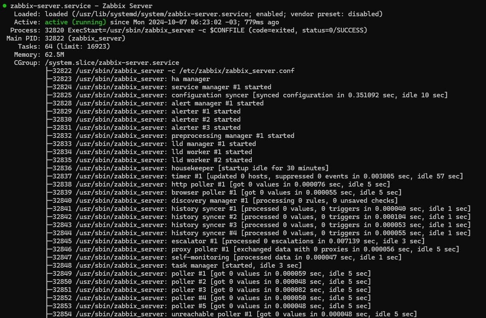

Verifique o log para identificar erros críticos

> tail -n 100 /var/log/zabbix/zabbix_server.log

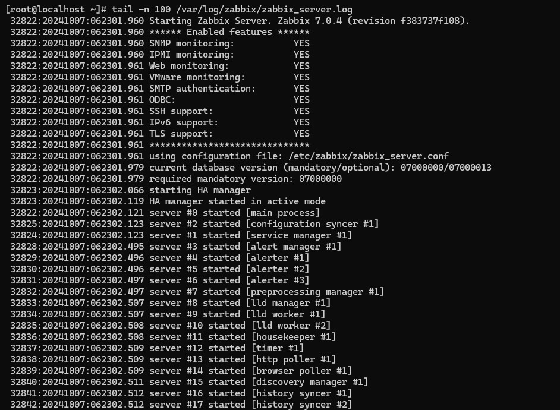

Esses erros de itens não suportado e **interface unavailable** não são erros críticos

Pronto o Zabbix Server já está instalado


## Instalando o Frontend do Zabbix

Iremos agora realizar a instalação do frontend com nginx.

Primeiro iremos alterar para o php 8:
```
dnf module switch-to php:8.0
```

Instalar o pacote do frontend e o pacote com as configurações do apache

> dnf install zabbix-web-mysql zabbix-nginx-conf 

Dependências sendo resolvidas

Configure o PHP para o Zabbix frontend:
Edita o arquivo /etc/nginx/conf.d/zabbix.conf e descomente o 'listen' e 'server_name', server_name altere para o IP de seu ambiente.

> vi /etc/nginx/conf.d/zabbix.conf

```
   listen 80;
   listen [::]:80;
   server_name 172.17.71.251;
```
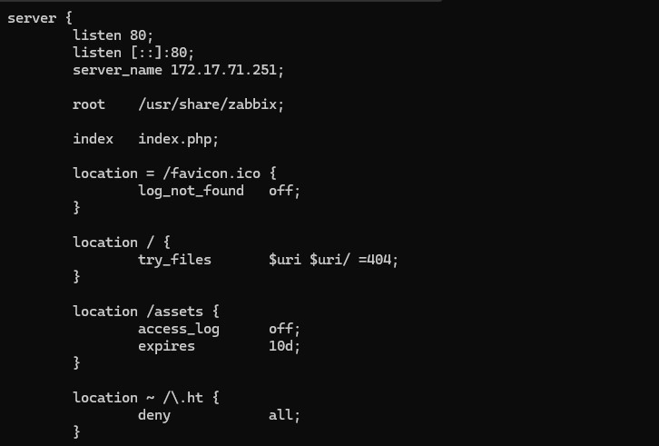

Habilite a inicialização automática, inicie o serviço e verifique o status
```
systemctl enable nginx php-fpm --now
systemctl status nginx
```
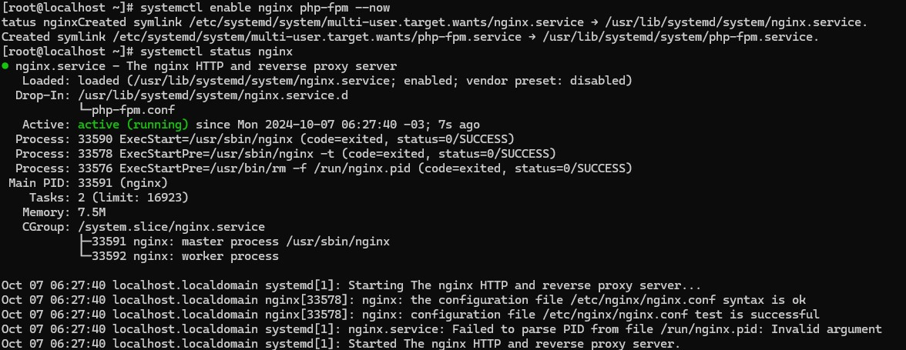

Crie a regra de firewall e faça reload nas configurações do firewalld
```
firewall-cmd --permanent --add-service=http
firewall-cmd --reload
```

Acesso o frontend pelo navegador para as últimas configurações

URL: http://IP_SERVIDOR

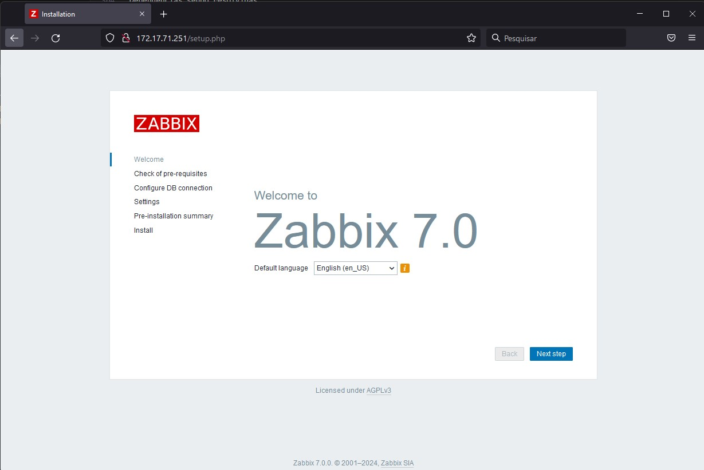

Clique em Next step

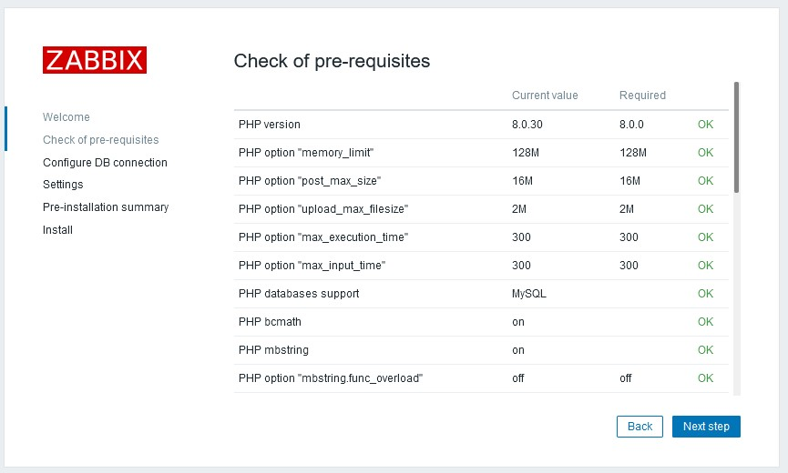

Será exibida uma tela de verificação dos pré-requisitos do frontend, se estiver tudo OK
clique em Next step

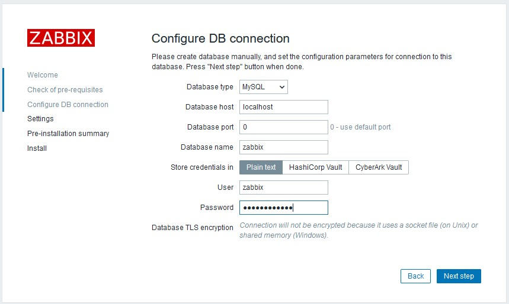

Na configuração de conexão com o banco de dados insira a senha em **Password** e clique em **Next Step**.

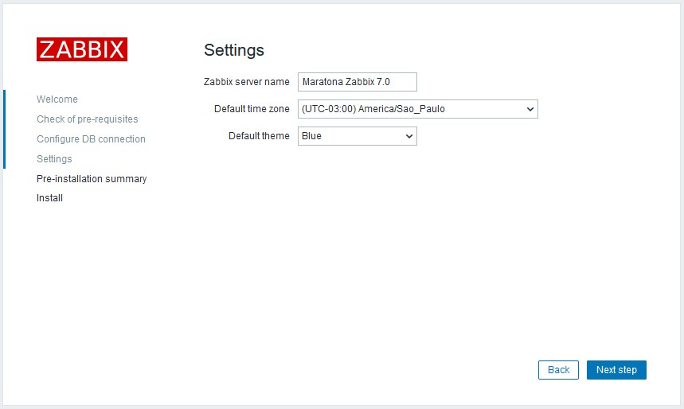

Nesta tela insira o **Nome de exibição do Zabbix server** e selecione o **timezone padrão** (America/Sao_Paulo)
em seguida clique em **Next step**.

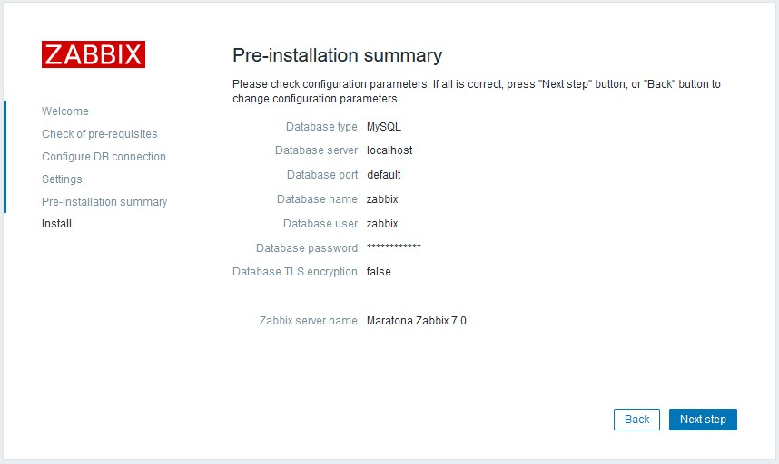

Será exibido um sumário da instalação, se precisar editar clique em **Back** se não clicar em
**Next step**.

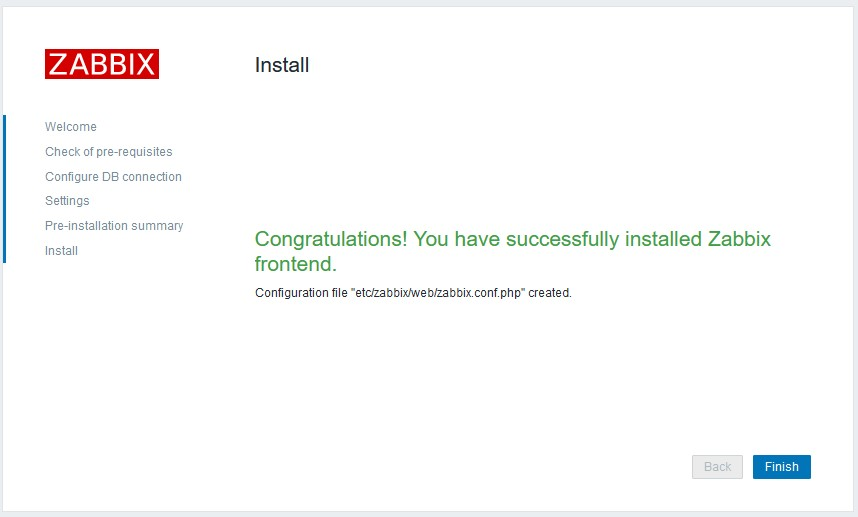

Configurações concluídas e o arquivo de configuração do PHP foi criado em
**/etc/zabbix/web/zabbix.conf.php**

Clique em **Finish**

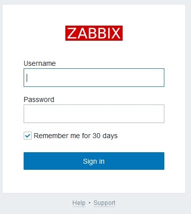

Será exibida a tela de login.

As credenciais padrão são:
* Usuário: Admin
* Senha: zabbix

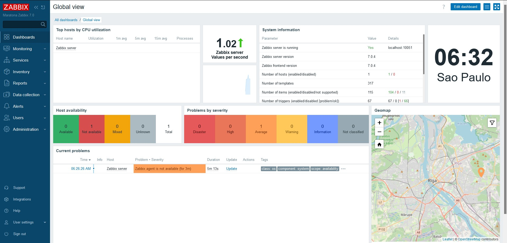

Pronto, agora você tem acesso ao frontend do Zabbix.

Para validar se está tudo correto clique em Reports > System Information

Zabbix server is running o valor for igual a **Yes** está tudo funcionando como esperado até
agora

Parabens, você realizou com sucesso a instalação do seu ambiente!